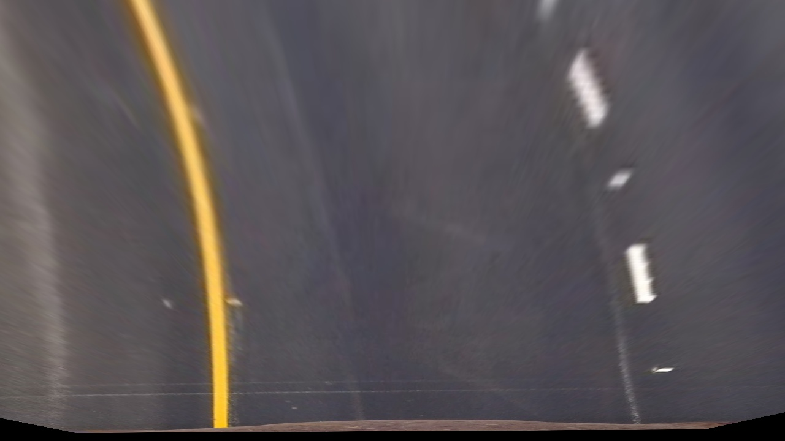
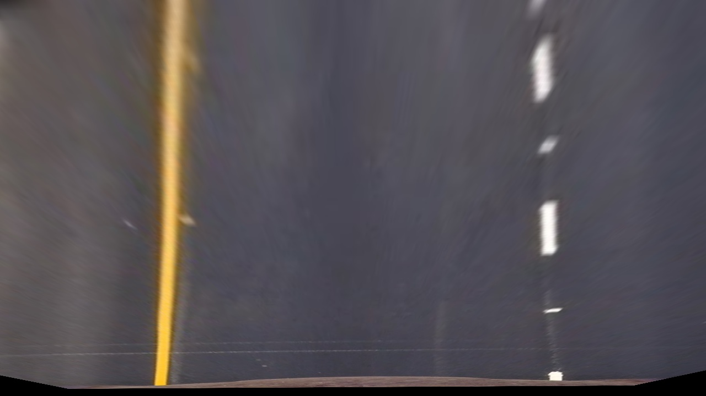

## Advanced Lane Finding

This is the fourth project in the Udacity Self-Driving car nanodegree.

The goals / steps of this project are the following:

* Compute the camera calibration matrix and distortion coefficients given a set of chessboard images.
* Apply a distortion correction to raw images.
* Use color transforms, gradients, etc., to create a thresholded binary image.
* Apply a perspective transform to rectify binary image ("birds-eye view").
* Detect lane pixels and fit to find the lane boundary.
* Determine the curvature of the lane and vehicle position with respect to center.
* Warp the detected lane boundaries back onto the original image.
* Output visual display of the lane boundaries and numerical estimation of lane curvature and vehicle position.

---
### Camera Calibration

#### 1. Briefly state how you computed the camera matrix and distortion coefficients. Provide an example of a distortion corrected calibration image.

With a set of camera calibration images (chessboards) in the camera_cal folder I am able to calculate the camera distortion parameters and use these to un-distort our images.

First of all I need to detect the inner-corners of the calibration images. This can be seen in cell 2 and 3 of the jupyter notebook: `Camera Calibration.ipynb`. In these cells I find and display the chessboard corners for each of the calibration images using OpenCV.

In finding the corners I also prepare an "object points" array, which will be the (x, y, z) coordinates of the chessboard corners in the world. Here I'm assuming the chessboard is fixed on the (x, y) plane at z=0, such that the object points are the same for each calibration image.  Thus, `objp` is just a replicated array of coordinates, and `objpoints` will be appended with a copy of it every time I successfully detect all chessboard corners in a test image.  `imgpoints` will be appended with the (x, y) pixel position of each of the corners in the image plane with each successful chessboard detection.  

I then used the output `objpoints` and `imgpoints` to compute the camera calibration and distortion coefficients using the `cv2.calibrateCamera()` function.  I applied this distortion correction to the test image using the `cv2.undistort()` function and obtained this result:

Before                     |  After
:-------------------------:|:-------------------------:
  |  

### Pipeline (single images)

#### 1. Provide an example of a distortion-corrected image.
Below is an example of a before and after distortion-corrected test image. Note the repositioning of the white car which is actually further back once camera distortion is correct for...
See cell 18 of `Camera Calibration.ipynb` for the code how I accomplished this. Its simply a matter of running the camera calibration using the already computer object and image points and then passing these to `cv2.undistort()`.

(One point to be careful of is that OpenCV reads and write images in BGR format. I use `cv2.cvtColor` to switch to RGB and back again.)

Before                     | After
:-------------------------:|:-------------------------:
 |  

I've wrapped the camera undistortion code into the function `undistort_image()` for later use. This is in notebook cell 4.

#### 2. Describe how (and identify where in your code) you used color transforms, gradients or other methods to create a thresholded binary image.  Provide an example of a binary image result.
I used a combination of color and gradient thresholds to generate a binary image (thresholding steps at lines # through # in `another_file.py`).  Here's an example of my output for this step.  (note: this is not actually from one of the test images)

![alt text][image3]

#### 3. Describe how (and identify where in your code) you performed a perspective transform and provide an example of a transformed image.

The code for my perspective transform is in notebook cells 9 through 11. It starts with a function called `warp_image()` which uses the OpenCV `getPerspectiveTransform()` and `warpPerspective()` functions.

Cell 10 is where I work out a good set of image coordinates to use as the perspective transforms source and destination points. I have also plotted the source and destination points on a test image in this notebook cell.

I have aimed for the source points to make out a trapezoidal shape just large enough to contain the lane lines (with a margin for road width changes) and reaching into the distance approx. 1/3 the way up the image.

For the destination points I have fixed them as a rectangle the size of the source image.

This resulted in the following source and destination points:

| Source        | Destination   |
|:-------------:|:-------------:|
| 0, 720        | 0, 720        |
| 1280, 720     | 1280, 720     |
| 800, 480      | 1280, 0       |
| 480, 480      | 0, 0          |

Here is some examples of a warped test images:

| Curved road                       | Straight road             |
|:---------------------------------:|:-------------------------:|
|  |  |

As can above, I verified that my perspective transform was working as expected by drawing the `src` and `dst` points onto a test image and its warped counterpart to verify that the lines appear parallel in the warped image.

#### 4. Describe how (and identify where in your code) you identified lane-line pixels and fit their positions with a polynomial?

Then I did some other stuff and fit my lane lines with a 2nd order polynomial kinda like this:

![alt text][image5]

#### 5. Describe how (and identify where in your code) you calculated the radius of curvature of the lane and the position of the vehicle with respect to center.

I did this in lines # through # in my code in `my_other_file.py`

#### 6. Provide an example image of your result plotted back down onto the road such that the lane area is identified clearly.

I implemented this step in lines # through # in my code in `yet_another_file.py` in the function `map_lane()`.  Here is an example of my result on a test image:

![alt text][image6]

---

### Pipeline (video)

#### 1. Provide a link to your final video output.  Your pipeline should perform reasonably well on the entire project video (wobbly lines are ok but no catastrophic failures that would cause the car to drive off the road!).

Here's a [link to my video result](output_images/project_video_output.mp4)

---

### Discussion

#### 1. Briefly discuss any problems / issues you faced in your implementation of this project.  Where will your pipeline likely fail?  What could you do to make it more robust?

Here I'll talk about the approach I took, what techniques I used, what worked and why, where the pipeline might fail and how I might improve it if I were going to pursue this project further.

The results with very limited tuning of the image thresholding and no smoothing between frames or error handling are impressive on the test video.
However it all falls apart on the challenge videos largely because of the different road surfaces and vertical lines in the surface.
I can see that for every different road surfaces or driving conditions we would have to further tune the image thresholding and so on, which I think is a major limitation of this computer vision technique.
So long as we could accumulate enough driving data I'd be much more inclined to use a deep convolutional network and let it train and find the lanes...
